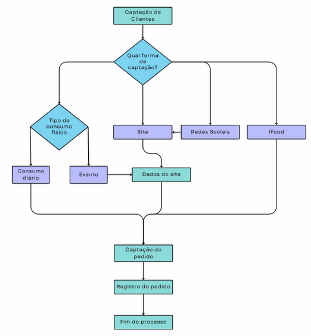

# ETAPA 1

## 1.1 Introdução

O presente trabalho se trata de projeto de conclusão de curso, com o objetivo de promover um estudo de negócio e de mercado da empresa Zuzunely, aplicando os conhecimentos de tecnologia de informação apresentados no decorrer do curso. No decorrer do projeto, será desenvolvido uma consultoria na área de nosso estudo, buscando apresentar soluções práticas a realidades enfrentadas pela empresa.

A primeira etapa será subdivida em cinco tópicos: 1 – Introdução; 2 – Descrição da empresa; 3 – Análise de mercado; 4 – Matriz SWOT; e 5 – Mapeamento de processos de negócios.

## 1.2 Descrição da Empresa

A Zuzunely foi fundada em 2018 pela chef Bruna Haddad, inicialmente como um pequeno restaurante no bairro Anchieta, com a proposta de unir talento, orçamento limitado e um grande sonho. O nome do restaurante é uma homenagem às avós da chef, D. Zulmira e D. Nely. Durante a pandemia, a casa precisou fechar, mas a ideia ressurgiu com força em 2024, quando foi reaberto oficialmente em agosto, mantendo sua essência e ampliando sua presença.

Atualmente, a empresa conta com por volta de 15 colaboradores, além dos dois sócios fundadores. Além de atuar como restaurante e cafeteria, também realizam eventos externos e vendem produtos artesanais, como caixas de café da manhã, e produtos de fabricação própria, como pães, pastas e pratos. Ainda, também atuam por meio da plataforma iFood.

A empresa, atualmente, possuiu uma atuação regional, principalmente pelo alcance proporcionado pelo seu sítio na internet[^1] bem como pela utilização da plataforma iFood. Contudo, tendo em vista seu atual funcionamento ser em uma icônica casa construída por Oscar Niemeyer no bairro Santo Agostinho, ampliaram a operação, como já indicado.

Quanto ao público-alvo, majoritariamente é composto por pessoas de renda média-alta, entre 25 e 40 anos. Para além disso, durante o dia a dia, o fluxo de mulheres é geralmente maior, entretanto, também atendem uma quantidade relevante de casais e famílias.

Em média, atendem por volta de 300 e 400 pessoas semanalmente. Devido a qualidade do que é fornecido na empresa, muitos clientes são fidelizados, tendo em vista que possuem um índice alto de retorno, em que, vale ressaltar, ocorre mais de uma vez por mês.

## 1.3 Análise do Mercado

O mercado de cafeterias tem apresentado forte crescimento nos últimos anos, principalmente após o período de pandemia, tanto em Minas Gerais quanto no Brasil. A Associação Brasileira da Indústria de Café, com o Instituto Axxus, divulgaram pesquisa[^2] que apontou o aumento de frequência em cafeterias entre o ano anterior ao período pandêmico (em 2019), em relação ao pós período de emergência sanitária (em 2023), com variação de 48% para 51%. Vale ressaltar, ainda, que durante a pandemia (em 2021), a frequência de visitas à cafeterias foi, apenas, de 9%, o que impactou diretamente neste mercado.

Nessa senda, o SEBRAE publicou estudo[^3] em que “Entre os 170 respondentes, a maioria dos participantes declara que utiliza o Instagram como principal canal de divulgação, com 40,6% da amostra, seguido do Whatsapp, com 25,4%”. Frise-se, ainda, que site próprio ficou, apenas, em quarto lugar como modo de divulgação. Outro ponto importante deste estudo é que os clientes possuem “Interesses em conteúdos sobre gastronomia, empreendedorismo, turismo, saúde e bem-estar, e podcasts”.

Quanto a eventuais dificuldades do mercado, o estudo do SEBRAE aponta que nem todas as empresas possuem barista com formação (39.2%) ou com certificação (21%), o que pode indicar eventual prejuízo na qualidade do café servidor. Ademais, em relação ao fornecedores de café, quase 75% dos entrevistados mantém, apenas, até 3 (três fornecedores), podendo ser, também, um dos pontos de alerta para empresas desse setor.

Apesar das dificuldades enfrentadas o mercado para as cafeterias é promissor, uma vez que o café é a principal bebida consumida pelo brasileiro e o país é o principal produtor e exportador de café no mundo (disponível em:&lt; <https://www.gov.br/agricultura/pt-br/assuntos/noticias/brasil-e-o-maior-produtor-mundial-e-o-segundo-maior-consumidor-de-cafe>&gt;).

Deste modo, conforme exposto, continuamente são identificadas tendencias emergentes para o mercado de café, tendo em vista o seu grande potencial financeiro. Logo, a cafeteria Zuzunely deve estar atenta a essas tendencias e aproveitar essas oportunidades a fim de atrair e manter clientes, bem como se destacar no setor das cafeterias.

## 1.4 Matriz SWOT/FOFA

|     | **FORÇAS** | **OPORTUNIDADES** | **FRAQUEZAS** | **AMEAÇAS** |
| --- | --- | --- | --- | --- |
| 1   | Serviços diversificados | Crescimento do público consumidor jovem | Registro de dados de vendas em planilhas | Crescente concorrência |
| 2   | Boa reputação | Preferencia do público para ambientes acolhedores | Site precisando ser devidamente finalizado | Variação do preço de insumos |
| 3   | Rede social ativa | Produtos sustentáveis | Checagem manual de estoque | Falta de mão de obra qualificada |

## 1.5 Análise dos processos de negócio

### 1.5.1 Fluxo de atividades

De início, indique-se o seguinte fluxo de atividades da empresa analisada:

Dos processos mapeados, conforme imagem supracitada, o início do processo se dá com a captação de clientes. Essa busca, pode ocorrer por três meios, sítio na internet, redes sociais e iFood. A divulgação de cada uma delas ocorre de modo interseccional, tendo em vista que se tratam de modalidades virtuais, em que clientes captados por um meio podem usar o serviço através de outro.

Após, com a escolha realizada pelo cliente, ocorre a fase de captação de pedidos, que podem ser realizadas fisicamente (na unidade localizada no barro de Santo Agostinho) ou virtualmente, por meio do site na internet ou utilizando o aplicativo iFood. Os pedidos podem ser tanto os produtos comercializados (como os alimentos vendidos) ou a realização de eventos na unidade física.

Para pedidos físicos, o cliente acessa o cardápio por meio de um QR Code. Após acessar o cardápio, o cliente solicita registro do seu pedido, que posteriormente é enviado para a cozinha.

O pedido online é realizado através do site oficial, após cadastro prévio. Ainda, alguns itens, como caixas personalizadas, devem ser solicitados com 24 (vinte e quatro) horas de antecedência. De modo semelhante, o pedido pode ser feito por meio do iFood, onde também deve ser feito um cadastro prévio.

Vale ressaltar que, para a realização do evento, são levantadas algumas informações sobre o tipo de evento que o cliente deseja realizar e a disponibilidade dos dados a serem fornecidos. Devido a limitações do aplicativo, não é possível agendar eventos pelo iFood.

Após a finalização do pedido, no meio físico os dados são registrados no sistema “Realiza Software”. Já nos pedidos realizados no site, os dados são registrados no WordPress, com a subsequente anotação no “Realiza Software”. Por fim, o iFood possuiu o seu sistema próprio.

Com o registro do respectivo pedido, ocorre: a) entrega do produto; ou b) realização do evento. Finalizando, dessa forma, todo o processo analisado.

## 1.5.2 Sistemas utilizados

Os sistemas utilizados pela empresa são o WordPress, Realiza Software, Brevo e a ferramenta de gestão iFood.

### WordPress

Conforme se obtém no site do Wordpress[^4], tem-se as seguintes informações:

>“_O WordPress começou em 2003, quando “Mike Little” e “Matt Mullenweg” criaram uma ramificação do b2/cafelog. A necessidade de um sistema de publicação pessoal elegante e bem arquitetado já estava clara naquela época. Atualmente, o WordPress é desenvolvido em PHP e MySQL e licenciado sob a GPLv2. Ele também é a plataforma escolhida por mais de 43% de todos os sites da internet._
>_O projeto de código aberto do WordPress evoluiu de forma progressiva ao longo do tempo—com o apoio de desenvolvedores, designers, cientistas, blogueiros e outros profissionais qualificados e entusiastas. O WordPress oferece a oportunidade para qualquer pessoa criar e compartilhar, desde histórias pessoais até movimentos que mudam o mundo._
>_Pessoas com pouca experiência em tecnologia podem usá-lo sem problemas, pois vem “pronto para usar”, e pessoas mais experientes em tecnologia podem personalizá-lo de maneiras extraordinárias.“_

### Realiza Software

Conforme se obtém no site do Realiza Software[^5], tem-se as seguintes informações:

>“Nosso mercado alvo é composto por pequenas e médias empresas que reconhecem que implementação de Software de Gestão Empresarial gera diferencial competitivo para sua empresa.

_(...)_

>Estamos situados em Campinas-SP, em sede própria.
Contamos com equipe multidisciplinar, com amplo conhecimento técnico prático, e também com formação acadêmica em diversas áreas, tais como Tecnologia da Informação, Sistemas de Informação, Engenharia de Software, Gestão de Projetos e Administração.

_(...)_

>_Utilizamos metodologia para entrega de soluções em gestão empresarial, baseada nas melhores práticas de gestão de projetos existentes no mercado.
>Nossa metodologia tem como linha mestre, o acompanhamento muito próximo do usuário, durante todas as etapas da construção e entrega da solução. Acreditamos que, desta forma, a solução se torna de fato, aderente às necessidades_”

### Brevo

Conforme se obtém no site do Brevo[^6], tem-se as seguintes informações:

> “_Fundada em 2012 por Armand Thiberge na Índia e na França, a missão da Brevo é criar a suíte de gerenciamento de relacionamento com o cliente (CRM) mais acessível para proporcionar crescimento sustentável a todas as empresas e organizações sem fins lucrativos, promovendo conexões mais humanas e personalizadas._” 

### Ferramenta de Gestão do IFood

Conforme se obtém no site do IFood[^7], tem-se as seguintes informações:

>“_No Gestor de Pedidos, você acompanha o recebimento dos pedidos e gerencia a operação do seu restaurante. Com ele, você pode_:
>* _Gerenciar o recebimento e despacho de pedidos;_
>* _Confirmar ou rejeitar os pedidos conforme eles forem chegando;_
>* _Ver as informações do pedido, como forma de pagamento e local da entrega;_

_(...)_

>_No Portal do Parceiro, você configura todas as informações do seu restaurante e acompanha o seu desempenho. Com ele, você pode_:
>* _Configurar seu cardápio, horário de funcionamento, área e taxa de entrega;_
>* _Selecionar as formas de pagamento que seus clientes vão poder usar;_
>* _Ver as suas avaliações e responder os comentários dos clientes;_
>* _Acompanhar as suas vendas e conferir os seus repasses;_
>* _Acessar a área de ajuda para tirar dúvidas e falar com o nosso atendimento;_
>* _Acessar a área de ajuda para tirar dúvidas e falar com o nosso atendimento;_
>* _Contratar outros serviços oferecidos pelo iFood;_

_(...)_

>_iFood para Parceiros_
>_Com o app iFood para Parceiros, você consegue acompanhar a operação do seu restaurante em tempo real, na palma da mão. Você pode:_
> * _Receber notificações em tempo real;_
> * _Ver as suas avaliações e responder os comentários dos clientes;_
> * _Acompanhar os pedidos que chegam para o seu restaurante;_
> * _Editar os preços do seu cardápio e pausar itens, quando necessário”_

## 1.5.3 Análise e proposta de melhorias

As melhorias inicialmente propostas são divididas em físicas e virtuais. Pelas informações atualmente coletadas sobre a empresa, sua parte física é bem estruturada, com um ambiente que comporta uma boa quantidade de clientes e possui uma forma de realizar pedidos bem automatizada.

Para o meio virtual, a empresa possui uma boa estrutura inicial, com um sistema ERP, bem como sistemas que auxiliam no gerenciamento de redes sociais. A sugestão é que a empresa foque, também, em banco dados, para melhor gerenciar, por exemplo, os produtos mais e menos vendidos, facilitando assim o acompanhamento de estoque, com uma visão mais voltada ao real consumo realizado pelos clientes.

Para isso, sugere-se uma a melhor capacitação da equipe com as ferramentas já disponibilizadas, além de implementação de ferramentas de análise de dados como Power Bi, para melhor compreensão das vendas e dos seus clientes atendidos.

Deste modo, a análise dos processos e sistemas da empresa revela que, tanto no ambiente físico quanto no virtual, há uma estrutura sólida, mas com oportunidades para otimização e melhoria. O uso de ferramentas automatizadas já existentes demonstra um bom nível de digitalização e organização. No entanto, algumas áreas podem se beneficiar de aprimoramentos para impulsionar o desempenho e a rentabilidade, além de promoverem uma maior integração dos processos, otimização de recursos e, principalmente, uma maior satisfação do cliente.

[^1]:  Disponível em: &lt; <https://zuzunely.com.br/>&gt; 

[^2]: Disponível em: <<https://estatisticas.abic.com.br/wp-content/uploads/2023/11/2023_10_15_Pesquisa_Caf%C3%A9_H%C3%A1bitos_Preferencias_do_Consumidor2023.pdf>

[^3]: Disponível em: <[https://sebrae.com.br/Sebrae/Portal%20Sebrae/Arquivos/SEBRAE_RESUMO_PESQUISA_CADEIA_DOS_CAFES_2024%201%20(1).pdf](https://sebrae.com.br/Sebrae/Portal%20Sebrae/Arquivos/SEBRAE_RESUMO_PESQUISA_CADEIA_DOS_CAFES_2024%201%20%281%29.pdf)\> 

[^4]: Disponível em < <https://br.wordpress.org/about/>>

[^5]: Disponível em < <https://realizasoftware.com.br/a-empresa>>

[^6]: Disponível em < <https://realizasoftware.com.br/a-empresa/>>

[^7]: Disponível em < <https://realizasoftware.com.br/a-empresa/>>