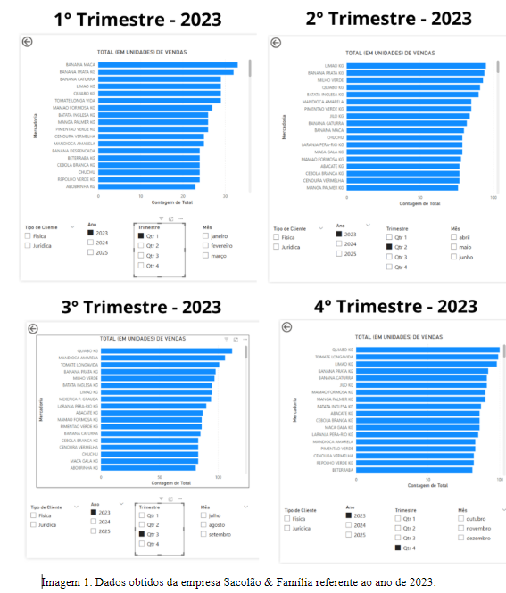
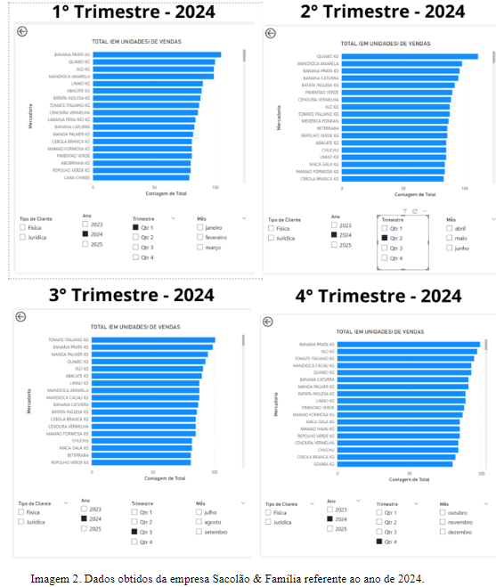
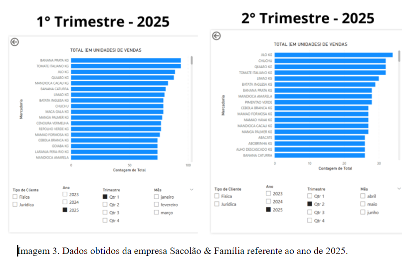
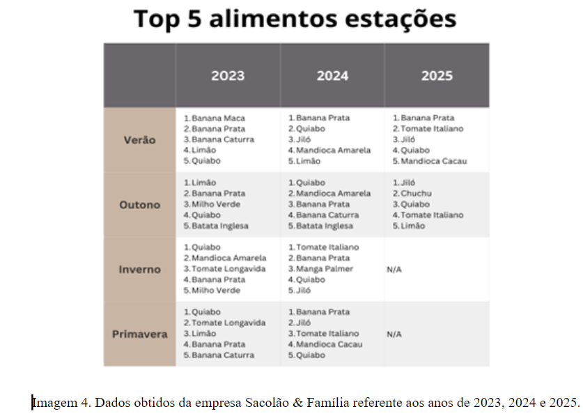
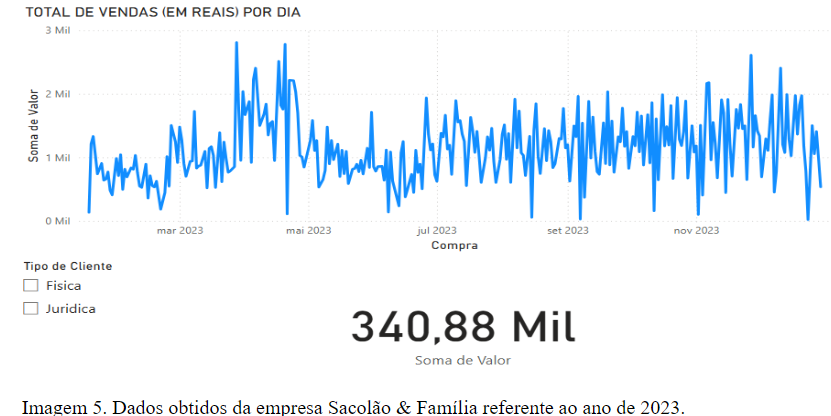
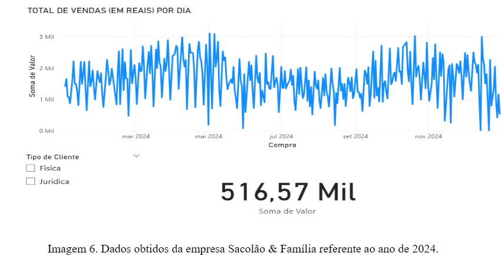
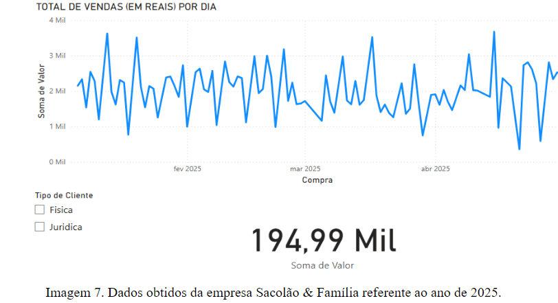
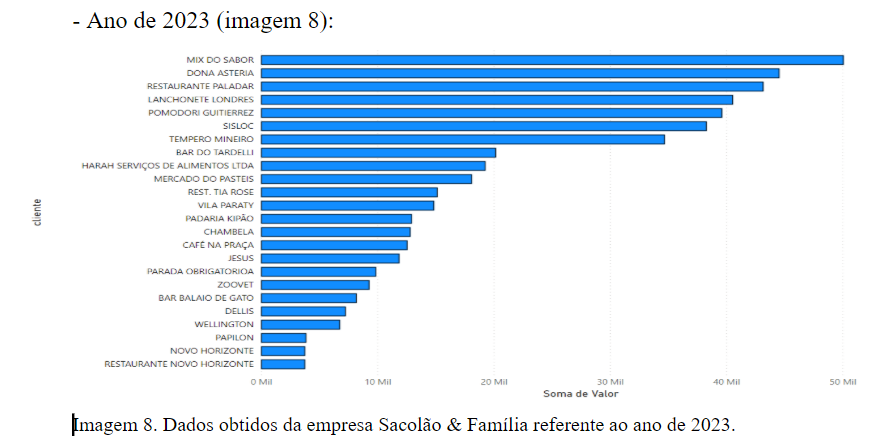
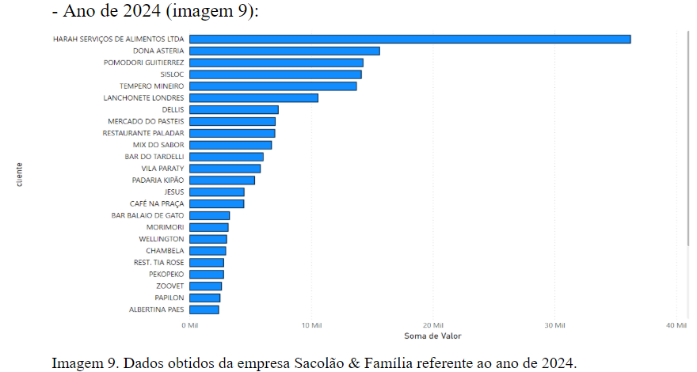
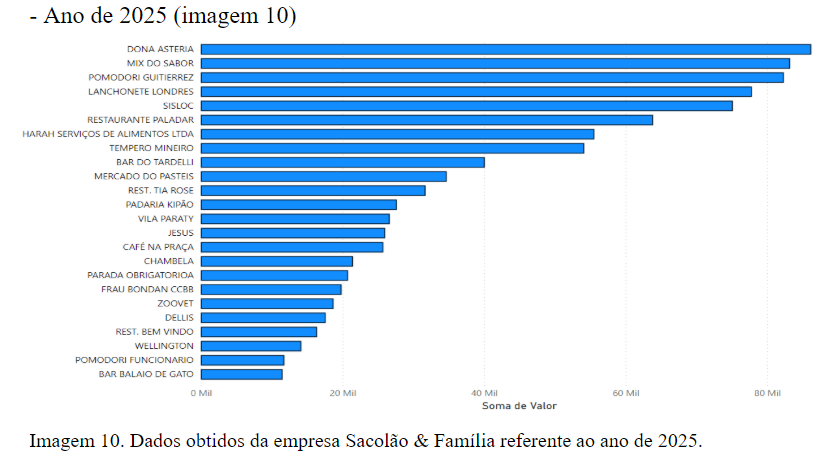

# 3. Etapa 3

## 3.1. Introdução da Etapa 3
A Etapa 3 deste projeto tem como objetivo o desenvolvimento de uma solução de Sistemas de Informação (SI) e Business Intelligence (BI) para a empresa Sacolão & Família, visando otimizar o entendimento e a análise dos dados gerados a partir das vendas. A implementação do Power BI será fundamental para transformar grandes volumes de dados de vendas em insights estratégicos, permitindo que a empresa tome decisões mais precisas e assertivas. O foco principal será melhorar a gestão de vendas, identificar tendências de consumo e aprimorar o planejamento de estoque e promoções. 

A solução proposta irá auxiliar a empresa a responder às questões críticas relacionadas ao comportamento de compra dos clientes e à dinâmica de vendas, promovendo uma análise mais eficiente da performance e das oportunidades de crescimento. 

Esta etapa será subdivida em seis tópicos: 1 – Introdução da Etapa 3; 2 - Apresentação da Solução que será desenvolvida; 3 - Justificativa da Escolha da Solução; 4 - Avaliação da Viabilidade Técnica e Financeira; 5 - Conexão com o Plano de IC e Planejamento da Solução; e 6 - Conclusão da Etapa 3. 

## 3.2. Apresentação da Solução que será desenvolvida 
A solução proposta consiste em uma plataforma de Business Intelligence (BI) integrada, que utilizará o Power BI para a análise de dados de vendas da Sacolão & Família. O sistema será capaz de coletar e processar informações sobre volumes de vendas, produtos mais vendidos, sazonalidades de consumo e outros dados operacionais essenciais. Essas informações serão transformadas em dashboards interativos e relatórios dinâmicos, proporcionando uma visualização clara e acessível das métricas de desempenho, como será demonstrado mais à frente. 

Com essa plataforma, a empresa poderá identificar padrões de compra dos clientes, analisar os períodos de maior demanda e ajustar suas estratégias de marketing, estoque e promoções de maneira mais eficiente. A integração entre os dados de vendas e a visualização no Power BI permitirá à Sacolão & Família a tomada de decisões para maximizar sua competitividade no mercado. 

## 3.3. Justificativa da Escolha da Solução 
A escolha do Power BI como plataforma de Business Intelligence (BI) é motivada pela sua capacidade de integrar grandes volumes de dados, extrair insights e criar relatórios dinâmicos que podem ser facilmente interpretados pelos gestores da Sacolão & Família. 

O Power BI oferece uma interface de fácil entendimento e ferramentas para análise de dados, o que facilita a visualização de tendências e a identificação de padrões de consumo. 

Além disso, a plataforma permite a criação de dashboards personalizados, que são essenciais para acompanhar em tempo real as vendas, o comportamento dos consumidores e a performance de produtos específicos. Esta análise contínua orientará a empresa a responder mais rapidamente às mudanças de demanda e a tomar decisões mais embasadas, impactando positivamente as áreas de gestão de estoque, planejamento de vendas e estratégias de marketing. 

## 3.4. Avaliação da Viabilidade Técnica e Financeira 
A implementação do Power BI é tecnicamente viável, pois a ferramenta é de fácil integração com outros sistemas e fontes de dados que a Sacolão & Família já utiliza para controlar suas vendas. A equipe interna da empresa pode ser treinada rapidamente para utilizar o Power BI, dado que a plataforma possui uma interface intuitiva e recursos avançados para análise e visualização de dados. 

O custo de implementação do Power BI é baixo, e, portanto, viável financeiramente, de modo que a versão gratuita da ferramenta pode atender às necessidades iniciais da empresa. Em um estágio posterior, a empresa pode optar por planos pagos, conforme a demanda por recursos adicionais. O investimento será mais que compensado pelos benefícios em termos de eficiência operacional, otimização de vendas e melhora na tomada de decisões, que resultarão em uma gestão mais estratégica e rentável. 

## 3.5. Conexão com o Plano de IC e Planejamento da Solução 
Com base nos dados preliminarmente disponibilizados pela empresa, foram observados dados referentes a, por exemplo, total de unidades de produtos (frutas, verduras, sementes etc.) vendidos no decorrer dos anos, bem como variação de padrões de compras entre pessoas físicas e pessoas jurídicas, além da evolução de vendas nos anos. 

Inicialmente, quanto aos produtos vendidos, foram gerados os seguintes gráficos para cada estação do ano (trimestre) do ano de 2023: 

Durante o ano de 2023 (imagem 1), os principais alimentos que estiveram no topo durante todo o ano foram: banana prata, banana caturra, quiabo, limão, batata inglesa e mamão formosa. Além disso, alguns alimentos permaneceram no topo boa parte do ano, porém, durante trimestres específicos, tiveram uma queda na venda, como por exemplo o tomate longa vida (queda no 2° trimestre), o que pode indicar uma sazonalidade recorrente. 

Já em 2024 (imagem 2), os principais alimentos que estiveram no topo durante todo o ano foram: banana prata, jiló, banana caturra, quiabo, tomate italiano e limão. Alguns alimentos permaneceram no topo boa parte do ano, porém durante trimestres específicos tiveram quedas durante as vendas, como é o caso, por exemplo, da batata inglesa (queda no 4° trimestre). 

Em relação ao ano de 2025 (imagem 3), a análise abrange até o início do segundo trimestre, cujas vendas ainda estão em andamento e deverão ser concluídas apenas no final de junho. Durante tal período analisado, foi constatado que os principais alimentos que estiveram no topo foram: banana prata, jiló, quiabo, tomate italiano e limão. É possível inferir, a partir de todos estes dados, que as frutas banana prata e quiabo, ao longo dos três anos analisados, permaneceram entre os produtos mais procurados. Neste sentido, compulsando todo período supracitado, fora gerada a seguinte tabela (imagem 4):

Em sequência, analisando as vendas por dia (de 2023 a 2025), tem-se como objetivo avaliar a evolução do total de vendas diárias (em reais) ao longo dos anos de 2023, 2024 e início de 2025, com base no relatório gerado pelo Power BI. A visualização contempla todas as categorias de cliente (Pessoa Física e Jurídica). 

Quanto ao ano de 2023 (imagem 5), observou-se que: 

De mais a mais, no ano de 2023, fora apresentado um crescimento gradual nas vendas até o mês de maio, com diversos picos de desempenho, alguns ultrapassando os `R$ 2.500,00` por dia. A partir de julho, as vendas se estabilizaram com menor oscilação negativa, indicando uma tendência de amadurecimento da operação. Como insight, tem-se se uma curva ascendente no primeiro semestre, seguida de um segundo semestre mais estável, o que sugere a consolidação de estratégias de vendas e fidelização de clientes. 

No ano de 2024 (imagem 6), fora obtida a seguinte imagem: 

Outrossim, no ano de 2023, observou-se um aumento expressivo no volume total de vendas em relação a 2023, com maior densidade e frequência de vendas diárias acima de `R$ 2.000,00`. Houve menor variação negativa, o que aponta para um desempenho mais consistente ao longo do ano. Logo, a performance de 2024 indica uma operação mais madura e possivelmente ampliada, com estratégias comerciais mais agressivas ou uma base de clientes mais ativa, o que resultou em um crescimento de aproximadamente 51% em relação ao ano anterior. 

Como já dito anteriormente, tendo em vista que o ano de 2025 é o corrente, os dados obtidos são referentes até o mês de abril (imagem 7): 

Igualmente, apesar de o período analisado ser parcial (até abril), é possível observar uma consistência nos valores diários de vendas, com vários dias acima de `R$ 2.000,00` e picos chegando próximos a `R$ 3.500,00.` No entanto, há também maior oscilação nos meses de março e abril, com quedas acentuadas em alguns dias. 

Portanto, o início de 2025 aponta para um desempenho promissor, com médias diárias que se equiparam às de 2024. Se a tendência se mantiver, é provável que o total anual supere o ano anterior. A volatilidade observada pode estar associada à sazonalidade, campanhas pontuais ou variações na demanda. Logo, neste aspecto analisado, tem-se uma evolução positiva nas vendas ao longo do tempo. O crescimento entre 2023 e 2024 foi significativo e sustentado, enquanto o início de 2025 mantém esse ritmo com potencial de superá-lo. 

Por fim, com base na pergunta chave realizada na etapa de inteligência competitiva (_“Quais as diferenças de perfis de compras entre compras de pessoas físicas e jurídicas?”_) foram feitos os seguintes gráficos com os dados coletados referentes a pessoa jurídica : 

A partir disto, foi identificado que os clientes com crescimento consistente, por exemplo, foram: DONNA ASTERIA (Subiu de 4º lugar em 2023 para o topo no ano de 2025, portanto a astratégia de fidelização ou relacionamento parece eficaz); TEMPERO MINEIRO (subiu significativamente, saindo das últimas posições em 2023 para o top 5 em 2025); e HARAH SERVIÇOS DE ALIMENTOS (Aparece fortemente em 2025, em 1º lugar, com impacto direto no acumulado). 

Ainda, os clientes com queda de desempenho foram: POMODORI GUITIERREZ (Apesar de liderar em 2023, caiu para 3º em 2025); MIX DO SABOR: (Apesar do pico em 2024, apresenta queda em 2025); e RESTAURANTE PALADAR (Alternância de desempenho sugere volatilidade). 

Foi possível, também, constatar que FRAU BONDAN CCBB e REST. BEM VINDO estavam bem posicionados em 2023, mas praticamente desaparecem em 2024 e 2025. 

Assim, é possível notar que há uma variedade de tipos de estabelecimentos como clientes, que vão desde restaurantes, bares, lanchonetes, cafeterias, padarias, até clientes não usuais, como foi o caso de um centro de acolhimento de animais silvestres (Zoovet). 

## 3.6. Conclusão da Etapa 3 
Diante de todo o exposto, mostra-se que o Sacolão & Família tem uma carteira de clientes dinâmica, com grandes variações ano a ano. Isso sugere oportunidades tanto de crescimento com novos entrantes quanto de fidelização dos clientes tradicionais. A adoção de ações estratégicas pode aumentar a previsibilidade de receitas e consolidar relacionamentos de longo prazo com os clientes mais valiosos. 

A análise das vendas diárias também evidenciou um crescimento constante nas receitas, com um desempenho mais consistente em 2024, em comparação a 2023. A volatilidade observada em 2025, embora preocupante em alguns momentos, apresenta uma oportunidade para ajustar estratégias de vendas e marketing. A empresa tem agora uma visão mais clara sobre suas operações, com insights que permitem antecipar tendências e ajustar a estratégia de forma mais ágil e precisa. 

Com as informações obtidas, a Sacolão & Família está bem-posicionada para tomar decisões mais informadas, fortalecer relacionamentos com clientes e adaptar-se rapidamente às mudanças no mercado, maximizando sua competitividade e resultados futuros. 

 